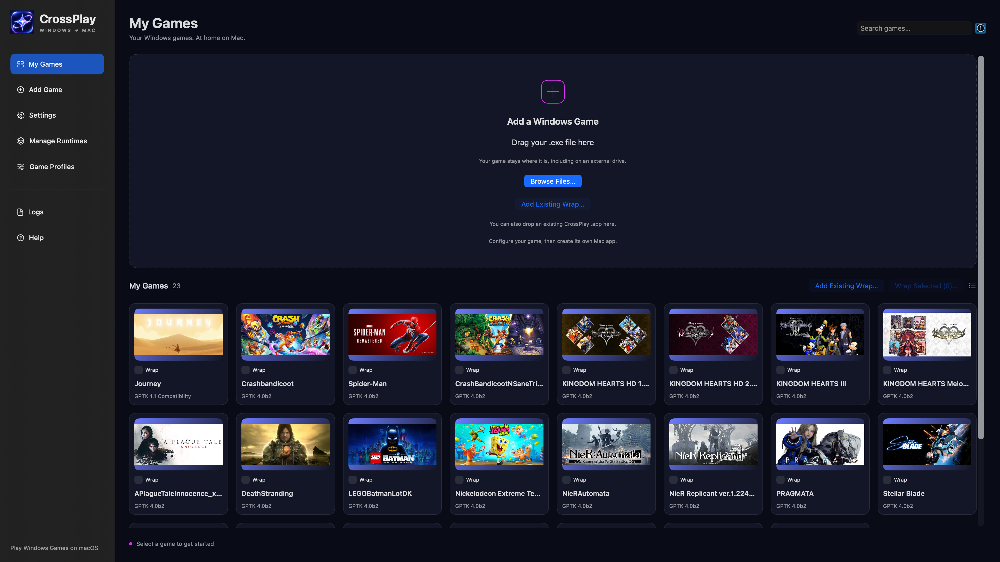

# CrossPlay

Native ARM64 AppKit launcher with a separate Foundation execution host in `Sources/ExecutionHost.swift`. The host validates Windows PE headers, detects likely engine graphics dependencies, manages an isolated prefix, initializes Windows registry/filesystem state, selects the game working directory, launches without a shell, and captures stdout/stderr plus exit status. Arguments are a JSON array; environment overrides are a JSON object. Graphics backend detection is a heuristic, not proof of the active renderer.

## Runtime provenance

- Wine 11.0: downloaded directly from the upstream Wine mirror tag `wine-11.0`, compiled locally as x86-64 Mach-O host plus x86-64 Windows PE modules. Wine implements PE loading, Windows APIs, registry and prefix functionality. License: LGPL-2.1-or-later; keep the source archive, build instructions and COPYING.LIB with any binary distribution. No commercial compatibility launcher or third-party Wine binary is used. A local LGPL driver-interface adaptation is recorded in `ThirdParty/Patches/wine11-apple-macdrv-interface.patch`. It exports Apple's published function table, supplies the older window-data layout, and handles Windows/Unix GS transitions for its Windows callbacks. The Wine 11 GS implementation is upstream code; the experimental Wine 10 PEB-slot patch was rejected after testing and is not part of the final runtime.
- Rosetta: Apple's installed x86-64 CPU translation, supplied by macOS. Not bundled.
- GPTK 4.0 beta 1: extracted from the user's official Apple evaluation DMG. Apple-supplied d3d11/dxgi/d3d12 DLLs and libd3dshared bridge call D3DMetal.framework and Metal. Apple supplies DirectX translation, not general Windows execution. The entire framework is preserved. The mounted/read-only disk image and original shader converter are not replaced.
- GNU Bison 3.8.2: build-only parser generator from GNU, GPL-3.0-or-later; not bundled in the app.
- LLVM/LLD: build-only upstream compiler/linker, Apache-2.0 with LLVM exceptions; not bundled in the app.

Apple's local license is preserved in `Evidence/Apple-License.txt`. Sections 2A/2C restrict distribution to non-commercial purposes and require notices; redistribution of the complete framework or individual redist components is permitted subject to those terms. This local evaluation build is not a commercial release. Shader Converter is not needed at launch and is not bundled. No Microsoft system DLLs are copied.

## Build

See `Evidence/wine11-configure.log`, `Evidence/wine11-build.log`, and `Evidence/source-sha256.txt` for source and build evidence. Wine was configured in a temporary path without spaces because GNU build tooling did not handle this workspace path reliably. `Scripts/package-runtime.py` copies our private installed build and official graphics bridge into the workspace. `Scripts/build-app.sh` compiles the launcher, packages runtime/licenses and signs/verifies it. Do not distribute the runtime without corresponding Wine source and applicable notices.

The app does not bundle the game. Per-game prefix and logs are stored in `~/Library/Application Support/GPTK4Launcher/`. CLI integration-test flags: `--select /path/game.exe --launch`, optionally `--arguments '["-screen-fullscreen","0"]'`. Process startup is never a claim of rendered gameplay.

## AGFT integration

`GameInfo` and `ExecutionHost` are independent of AppKit and can become an AGFT translation backend. Graphics and gameplay acceptance remain required before calling this a validated backend. Native conversion, static recompilation and engine transplantation are outside this launcher's scope.

## CrossPlay UI and game apps

The native SwiftUI/AppKit interface provides My Games, Add Game, Settings, Manage Runtimes, Game Profiles, Logs and Help. Import an EXE by browsing or dropping it; search and grid/list controls operate on the saved library. Compatibility, AVX, arguments and environment settings are saved per game in `~/Library/Application Support/CrossPlay/Library.json`. Existing runtime prefixes remain in the legacy storage location to preserve saves.

Create Mac App writes a lightweight, ad-hoc signed game bundle containing `GameProfile.json` and `CrossPlayBootstrap`. The bootstrap references the current CrossPlay host and reads the saved profile. Keep CrossPlay and the external game files at their recorded locations. The game name is the wrapper display name; the CrossPlay manager is hidden during wrapper launches. The command-line equivalent is `python3 Scripts/create-wrapper.py /path/game.exe /path/Game.app --runtime 'GPTK 1.1 Compatibility'`.

The permanent icon resources are `Artwork/CrossPlay-AppIcon.png` and `Resources/CrossPlay.icns`; the build embeds the icon before signing. Historical apps, assets and source snapshots remain under `Build/Checkpoints/20261005-CrossPlay/`. The workspace directory itself remains at the user-specified location.

## Game icons and artwork

Select a game and use **Find Game Icon** (or **Game Profiles → Search Game Icon**). CrossPlay searches Steam's public catalog with the entered title, displays title/image/app-ID results, and assigns only the result you explicitly choose. The chosen Steam app's metadata and image are fetched together; app ID and title are verified before applying. Edit the search title for generic EXE filenames or different editions. Local PNG/JPEG/TIFF/ICNS import is also available. Network failures leave existing artwork intact.

Artwork is copied into `~/Library/Application Support/CrossPlay/Artwork/` and associated with the exact game executable in the saved library. Library cards and the selected-game panel display it. **Create Mac App** renders seven ICNS sizes, embeds `GameIcon.icns`, sets `CFBundleIconFile`, and then signs the wrapper. Games without confirmed artwork receive a neutral icon containing game initials, not another game's image. Artwork provenance is included in native wrappers as `GameArtwork.json`.

For existing CrossPlay apps, select the matching game and use **Update Existing App Icon**. The saved wrapper executable must match the selected game. The app is staged, signed, verified and replaced only after passing checks; the original is retained as a sibling `-before-icon-<UUID>.app` backup. The bootstrap's host path is refreshed to the current CrossPlay location. Other app formats are left untouched.

CLI wrapping supports `--icon /path/to/confirmed-game.png`; without it the generator uses saved artwork only for the exact executable path, or the initials fallback. These features do not launch a game during icon lookup or packaging.

Use **My Games → Add Existing Wrap…** (also available in Add Game), or drop a CrossPlay game `.app` onto the window, to restore its saved launch settings and icon to the library. The source app is read without modification. The recorded game files must be available. Importing the same executable updates its library entry instead of adding a duplicate.

## Per-game Windows dependencies

CrossPlay checks Windows prerequisites before launch and offers **Install & Relaunch** or **Cancel**. **Game Profiles → Windows Dependencies → Manage Dependencies…** lists all supported components, their detected requirements, live installation status, immutable runtime ID and exact prefix. **Install Missing** skips verified components; **Repair Selected** uses the redistributable's repair command. The recovery action is also available when a game reports a prerequisite that static inspection missed. No graphical-dialog OCR is used.

The initial catalog covers Microsoft Visual C++ modern v14 (2015–2022 and later), 2013, 2012 and 2010, separately for x64 and x86. Older generations coexist with v14. Definitions include family/version, architecture, download source, filename, arguments and native-library detection; later prerequisite definitions can supply another product and installer options. DirectX and .NET packages are not currently implemented.

Requirements are executable import evidence plus optional `LibraryGame.dependencyRequirements`. Installation records live separately in `~/Library/Application Support/CrossPlay/DependencyState.json`, scoped to the executable path, immutable runtime ID and exact prefix path. They include verification time, installation date, installer SHA-256, status and diagnostic detail. Metadata never determines whether a DLL is present: checks read native PE library headers in `system32` (x64) or `syswow64` (x86), verify machine architecture and reject Wine builtin stubs. Required `vcruntime140_1.dll` is checked when referenced. Stale installation records are presented as needing repair.

Inspection retains the bounded EXE/UnityPlayer sampling and also follows PE normal/delay import RVAs with fixed section, descriptor and name limits. Game selection still reuses cached inspection. Launch upgrades old metadata once, and reuses the dependency inspection while EXE/UnityPlayer size and modification time match. Manually opening dependency management refreshes inspection on a worker.

Installers are downloaded only after native user approval, using HTTPS and an exact allowlist for Microsoft redirect hosts. They are cached at `~/Library/Caches/CrossPlay/DependencyInstallers`; cache receipts contain SHA-256 and are rechecked before reuse. Downloads require successful HTTP status, a bounded plausible file size and an MZ header. SHA-256 provides cache integrity, not independent publisher authentication; Authenticode signature verification is not currently implemented. Official catalog links come from Microsoft's supported redistributable download page: https://learn.microsoft.com/en-us/cpp/windows/latest-supported-vc-redist/

Installation uses a dedicated `ExecutionHost` carrying the game's exact immutable runtime and prefix. It reuses runtime validation, bottle initialization and the prefix launch lock. It never invokes system Wine or changes runtime selection. Exit success alone is insufficient: native DLL verification must pass before an installed record is saved or the original launch resumes. Downloads are not bundled in the source or app. Logs remain available in CrossPlay's Logs view and application-support Logs directory.

Detection remains a heuristic: dynamically loaded libraries, plugins, uninspected child executables, app-local DLL resolution and precise minimum runtime versions may require manual selection. x86 components can be explicitly selected alongside x64; runtime support for running them is still required. Native DLL checks establish component presence/architecture, not complete loader compatibility or game playability. The automatic relaunch path retains the selected runtime, prefix, launch arguments and environment.

## CrossPlay

### My Games

CrossPlay provides a unified library for Windows games running on macOS through supported Wine/GPTK runtimes.

